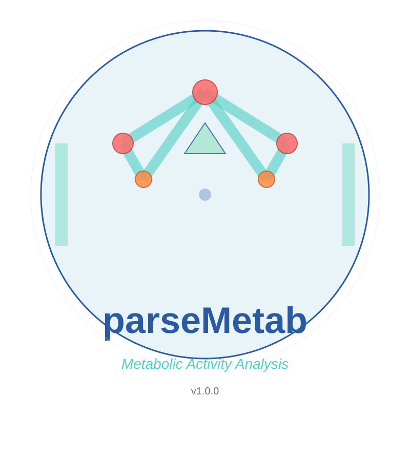

# parseMetab 

**Metabolic activity inference and analysis for omics data**


  
[](https://doi.org/10.5281/zenodo.21306120)


## Overview

parseMetab is an R package for inferring and analyzing metabolic activities from proteomics and transcriptomics data. It provides a complete workflow for:

- **Data parsing**: Convert CellFie outputs and pathway mappings into tidy, analysis-ready tables
- **Activity scoring**: Infer sample-wise metabolic activities using CellFie or pathway-based GSVA approaches
- **Differential analysis**: Perform limma-based differential testing on inferred metabolic activities
- **Network analysis**: Conduct coexpression network analysis on genes and proteins within metabolic classes
- **Survival integration**: Perform Kaplan-Meier and Cox proportional hazards regression with metabolic activities
- **Multi-cohort support**: Convenience wrappers for analyzing multiple cohorts (e.g., TCGA) simultaneously
- **Publication-ready visualizations**: Dotplots, volcano plots, heatmaps, circular plots, and more

## Key Features

✨ **Core Functionality**
- Parse CellFie outputs and metabolic pathway mappings into standardized data frames
- Support for both CellFie and GSVA-based metabolic activity scoring
- Flexible limma-based differential testing (including paired experimental designs)
- KEGG pathway integration for metabolic pathway analysis
- Coexpression network analysis within metabolic classes
- Survival analysis capabilities (Kaplan-Meier, Cox regression)

📊 **Visualization Suite**
- Dotplots for multi-cohort pathway comparisons
- Volcano plots for differential testing results
- Task score heatmaps with hierarchical clustering
- Circular barplots for sample size summaries
- Effect size boxplots stratified by cancer type or biological system
- Activity boxplots by cancer type or system

🔧 **Workflow Integration**
- Streamlined multi-cohort analysis pipelines
- Sample filtering and quality control
- Automatic table generation for downstream reporting

## Prerequisites

- **R** ≥ 4.0.0
- The following R packages (automatically installed): dplyr, ggplot2, igraph, stringr, tidyr, ggraph, tibble, limma, edgeR, GSVA, KEGGREST, viridis, matrixStats, ggh4x, pheatmap, openxlsx

## Installation

### From GitHub

This package is under active development. Install from GitHub using:

```r
# Install remotes if you don't have it
if (!requireNamespace("remotes", quietly = TRUE)) {
  install.packages("remotes")
}

# Install parseMetab with dependencies
remotes::install_github("Maj18/parseMetab", dependencies = TRUE)
```

### Using Docker

A pre-configured Docker container with parseMetab and all dependencies is available:

```bash
docker pull yuanli202004/cancer:v2.0.2
# Start the container:
docker run -it --rm -v $(pwd):/work yuanli202004/cancer:v2.0.2 bash
# Within the docker, activate the conda env:
conda activate SMS7546
# Navigate the shared folder:
cd /work/
# Start R and here you go...
R
```

### Local Development Installation

To install from a local copy (for development):

```r
devtools::install("./parseMetab", dependencies = TRUE)
```

## Example workflows

Example workflows and full analysis pipelines can be found in the [project repository](https://github.com/Maj18/cancer).


For detailed parameter documentation and additional examples, see individual function help pages:

```r
?makeLimmaDotplot_TCGA
?runLimmaCellFie
?processCellFieOutput
?makeTaskScoreHeatmap_CellFie
```

## Available Functions

### Data Processing
- `processCellFieOutput()` - Parse CellFie output files into standardized format
- `getdb_metabolism()` - Retrieve metabolic pathway database
- `getSystem()` - Extract biological system information

### Analysis
- `runLimmaCellFie()` - Wrapper for limma differential testing on CellFie scores
- `GSVAlimmaTest()` - GSVA-based scoring and differential testing
- `limmaTest_CellFie()` - Low-level limma testing interface
- `systemDiffAnalysis()` - Differential analysis by biological system
- `metabolicSurvival_Kaplan_Meier()` - Survival analysis integration
- `metabolicSurvival_coxreg()` - Cox proportional hazards regression

### Visualization
- `makeLimmaDotplot_TCGA()` - Multi-cohort comparison dotplot
- `doVolcano_CellFie()` - Volcano plot visualization
- `makeTaskScoreHeatmap_CellFie()` - Heatmap of task scores
- `ActivityBoxplot_byCancer()` - Activity levels by cancer type
- `ActivityBoxplot_bySystem()` - Activity levels by biological system
- `makeEffectSizeBoxplot_cancer()` - Effect sizes by cancer type
- `makeEffectSizeBoxplot_system()` - Effect sizes by system
- `diffEffectBoxplot_byCancer()` - Differential effect visualization
- `SigNrBarplot()` - Significant results summary
- `SampleSizeCircularBarplot()` - Sample size visualization
- `plotTaskSizes()` - Task/pathway size distribution

### Utilities
- `sumUpTaskScores()` - Aggregate task scores
- `visualizeDiffFeatures()` - Differential feature visualization
- `visualizeGSsizeClass()` - Gene set size class visualization
- `visualizeGSVSscoresClass()` - GSVA scores visualization

## Development & Documentation

### Maintaining Documentation

The package uses roxygen2 for documentation. Keep Rd files and NAMESPACE in sync:

```r
# From R in the package directory
if (!requireNamespace("devtools", quietly = TRUE)) {
  install.packages("devtools")
}

# Generate documentation from roxygen comments
devtools::document(pkg = "parseMetab")

# Run full package checks
devtools::check(pkg = "parseMetab")
```

Or from the shell:
```bash
R CMD check parseMetab
```

### Adding Dependencies

If `R CMD check` reports missing imports:
1. Add package name to `Imports:` field in `parseMetab/DESCRIPTION`
2. Use `package::function()` or `@importFrom package function` in roxygen comments
3. Rerun `devtools::document()`

### Handling Examples

For examples that are data-intensive or require unavailable packages, wrap them in `\dontrun{}`:

```r
#' @examples
#' \dontrun{
#'   # This example requires external data
#'   result <- heavyComputationExample()
#' }
```

## Contributing

We welcome contributions! Please follow these guidelines:

- **Bug reports & feature requests**: Open an issue on GitHub with a clear description
- **Documentation changes**: Edit roxygen comments in `R/*.R` files, then run `devtools::document()`
- **Code contributions**: Ensure code passes `devtools::check()` before submitting pull requests
- **Testing**: Add examples to roxygen documentation blocks

## Troubleshooting

**Q: Installation fails with "package not found" errors**
A: Ensure all dependencies are installed. Run `remotes::install_github("Maj18/parseMetab", dependencies = TRUE)` with `dependencies = TRUE`.

**Q: KEGG data retrieval is slow or fails**
A: KEGGREST queries can be slow. Consider caching results with `getdb_metabolism()`.

**Q: Plots not saving correctly**
A: Verify output directories exist. Use `dir.create()` to create output folders before passing to plotting functions.

**Q: Memory issues with large datasets**
A: Consider subsetting samples or using data.table for intermediate processing.

## Citation

If you use parseMetab in your research, please cite:

```bibtex
@software{li2026parsemetab,
  author = {Li, Yuan},
  title = {parseMetab: Metabolic Activity Inference and Analysis for Omics Data},
  year = {2026},
  version = {1.0.4},
  url = {https://github.com/Maj18/parseMetab},
  doi = {10.5281/zenodo.21306120}
}
```

Or in text format:

```
Bai et al. (2026) Pan-cancer metabolic landscapes: A multi-omics view. In review.
Yuan Li (2026). parseMetab: Metabolic activity inference and analysis for omics data. 
R package version 1.0.4. https://doi.org/10.5281/zenodo.19153922
```

## License

This project is licensed under the GPL (>= 3) License. See [DESCRIPTION](DESCRIPTION) for details.

## Contact & Support

**Author/Maintainer**: YUAN LI  
**Email**: [yuan.li@nbis.se](mailto:yuan.li@nbis.se)

---

*Last updated: Maj 2026*


